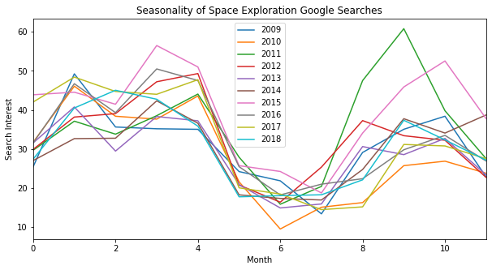
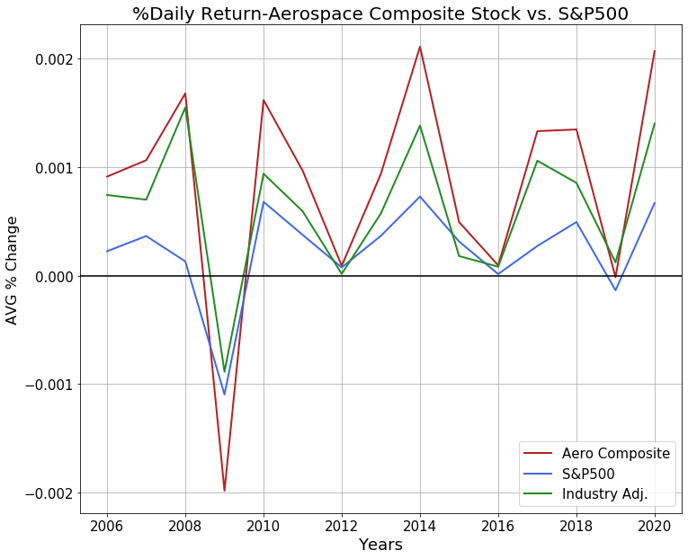
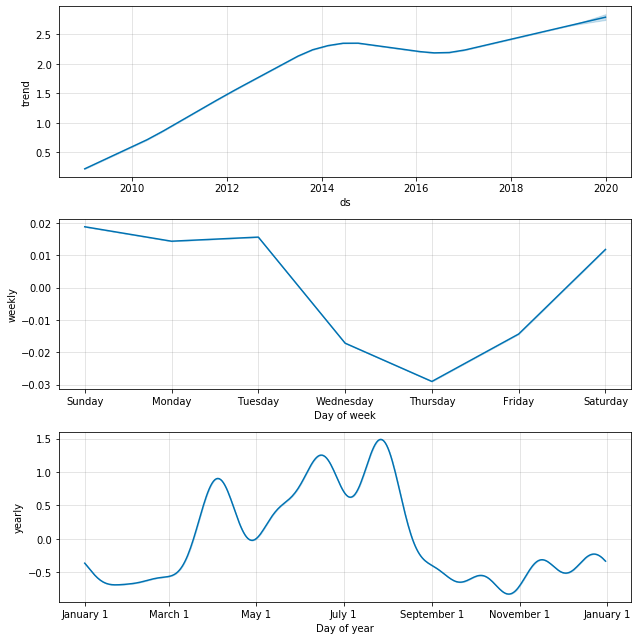
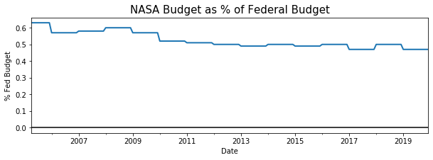

# Space Trends
by Matthew Oliver

## Project Outline
Presentation: https://docs.google.com/presentation/d/1E20EOmdIhKCCQjmyYJTAfbWW0bZ7-Bio9ckfyph84RQ/edit?usp=sharing
How does (US) Interest in Space Exploration change over time? 
Are there seasonal dependencies or external factors?
The goal of this project is to build a forecasting model for public interest in space exploration using data from Google Trends on searches for space exploration in the US over the last decade. Several exogenous features were selected for the forecasting model from potentially corolary trends.

## Data Collection
### Google Trends
Historical search interest data was obtained through the PyTrends python package for a selection of space-related terms. Time decompositions of different earch terms were done, with differing results. 'Space Exploration' was the term brought forward for modelling due to its consistent seasonality and lack of search peaks. Other terms such as 'Space-X' or 'Mars Exploration' were not used due to the search interest being highly erratic, peaking from random company press releases or events, which are hard to account for in the model.

'Space Exploration' as a search term seems to follow a "school year" trends, dropping in the summer and during the holidays

### Space Stocks
The first variable for the model was a compostie stock of the largest defense/aerospace companies, which, in theory, would be reflective of public financial interest in space exploration and commercialized space markets. The historic stock returns of the largest (by 2019 market cap) were pulled from the AlphaVantage stock API. The daily stock value was first calculated as a percent change from the previous trading day to normalize with the other companies, and then aggregated with the other stocks. This daily return had the daily percent return of the S&P 500 subracted from it to isolate it from overall market trends. 

### SCI-FI Movie Prevalence
The second variable used was a quantified value for the prevalence of SCI-FI movies in the box office. To obtain this, the historical daily box office records were obtained from BoxOfficeMojo.com through the Selenium web-based scraper. The quantified value used was the number of every movie that was labeled as Science Fiction in the box office top 10 for that day. 

### NASA Budget
The third value found was the yearly budget of NASA as a percent of total fed spending. One of the main functions of NASA is to advance our knowledge of planetary sciences and research potential human space endeavors, which could potentially impact our interest in space travel and exploration. The yearly values for the budget were taken drectly from the NASA website, with the 2020 planned budget used for forcasting

## Models
Both Statsmodel's Sarima and Facebook Prophet were used to build models and perform decomposition. The Sarima model was chosen in favor of FBProphet for having better interpretability and robustness. 

### initial Arima Time Decompostion

### 2020/2021 Forecast with NASA Budget
